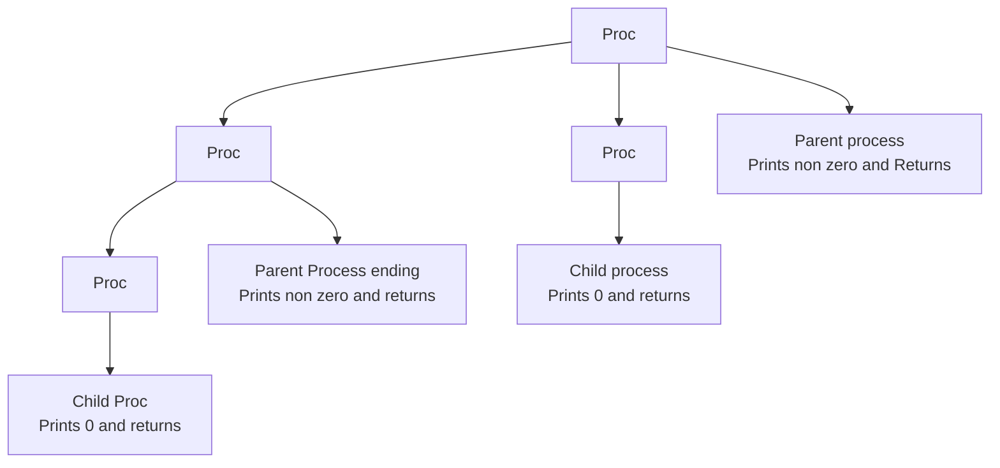

# FORK

fork creates a new process and copies the code below the fork line in the new process <br>
fork returns the process id, which is 0 for child and non zero for main process

```
#include <unistd.h>
#include <stdio.h>
int main() {
  int id = fork();
  if(id == 0) printf("Hello from child process\n");
  else printf("Hello from main process - %d", id);
}
```
produces
```
Hello from child process
Hello from main process - 3328
```

# WAITING FOR PROCESSES TO GET OVER

Lets create two processes. 1 to print 1 - 5 and 2nd to print 6 - 10. But sequencially 1 - 5 and 6 - 10 <br>
Look at the following program 
```
#include <stdio.h>
#include <unistd.h>
int main()
{
    int id = 0, n;
    id = fork();
    if(id == 0) n = 1;
    else n = 6;
    for(int i = n; i < n+5; i++) {
        printf("%d ", i);
        fflush(stdout);
    }
    return 0;
}
```
produces
`6 7 8 9 10 1 2 3 4 5` (mostly) <br>
The way to bring sequence is wait for the child process to finish execution.

```
#include <stdio.h>
#include <unistd.h>
#include <sys/wait.h>
int main()
{
    int id = 0, n;
    id = fork();
    if(id == 0) n = 1;
    else n = 6;
    int res;
    if(id) wait(&res); // the argument can be a NULL as well
    for(int i = n; i < n+5; i++) {
        printf("%d ", i);
        fflush(stdout);
    }
    return 0;
}
```
produces
`1 2 3 4 5 6 7 8 9 10` <br>
wait() return -1 if there is no child to wait for <br>
or it returns the pid for which the wait got completed.

# SOME USEFUL APIS

* get Process id `getpid()`
* get Parent Process id `getppid()`
* wait for child to finish execution `int wait(int * or NULL)`, returns the child process pid after it returns or -1 if no child to wait for.

# SOME IMPORTANT CONCEPTS

* If a child is spawned and before it returns, the parent is dead, then its ppid is not the earlier parent pid. Its dynamically assigned by the OS.

# VISUALIZING FORK

lets visualize this program
```
#include <stdio.h>
#include <unistd.h>
#include <sys/wait.h>
int main()
{
    int id = 0;
    id = fork();
    id = fork();
    printf("%d\n", id);
    int res = 0;
    while(res != -1)
        res = wait(NULL);
    return 0;
}
// Note: Each process waits for the wait() call to return a -1 which means there are no child to wait for.
```
produces 
```
483
0
485
0
```


Another way of visualization
```
int main()
{
    int id1, id2;
    id1 = fork();
    id2 = fork();   
    if(id1 == 0) { // child {
        if(id2 == 0) printf("Child of the child\n");
        else printf("Child\n");
    }
    else {
        if (id2 == 0) printf("Child of the main\n");
        else printf("Main");
    }
    int res = 0;
    while(res != -1) res = wait(NULL);
    return 0;
}
```
Produces 
```
Child
Child of the child
Child of the main
Main
```

## ERROR CHECKS

best way to wait is `while(wait(NULL) != -1 || errno != ECHILD)` <br>
include `<errno.h>` for getting `errno` and `ECHILD`


# INTERPROCESS COMMUNICATION `PIPES`

A pipe is an in-memory file with a read and write end <br>
```
inf fd[2];
pipe(fd); // Returns -1 if pipe crreation fails
       =========================
Reading end fd[0]       Reading end fd[1]      
       =========================
```
Exercise - Create a child and send some data to child and get some data back from child


