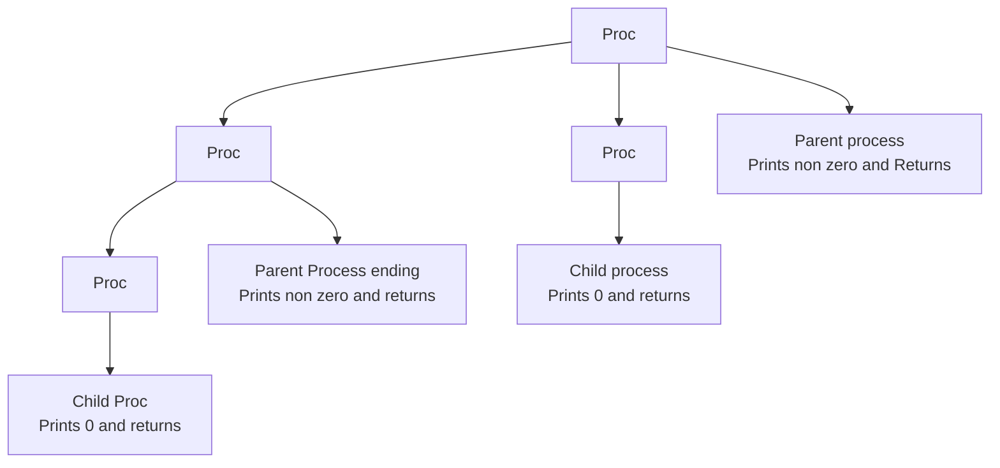

# FORK

fork creates a new process and copies the code below the fork line in the new process <br>
fork returns the process id, which is 0 for child and non zero for main process

```
#include <unistd.h>
#include <stdio.h>
int main() {
  int id = fork();
  if(id == 0) printf("Hello from child process\n");
  else printf("Hello from main process - %d", id);
}
```
produces
```
Hello from child process
Hello from main process - 3328
```

# WAITING FOR PROCESSES TO GET OVER

Lets create two processes. 1 to print 1 - 5 and 2nd to print 6 - 10. But sequencially 1 - 5 and 6 - 10 <br>
Look at the following program 
```
#include <stdio.h>
#include <unistd.h>
int main()
{
    int id = 0, n;
    id = fork();
    if(id == 0) n = 1;
    else n = 6;
    for(int i = n; i < n+5; i++) {
        printf("%d ", i);
        fflush(stdout);
    }
    return 0;
}
```
produces
`6 7 8 9 10 1 2 3 4 5` (mostly) <br>
The way to bring sequence is wait for the child process to finish execution.

```
#include <stdio.h>
#include <unistd.h>
#include <sys/wait.h>
int main()
{
    int id = 0, n;
    id = fork();
    if(id == 0) n = 1;
    else n = 6;
    int res;
    if(id) wait(&res); // the argument can be a NULL as well
    for(int i = n; i < n+5; i++) {
        printf("%d ", i);
        fflush(stdout);
    }
    return 0;
}
```
produces
`1 2 3 4 5 6 7 8 9 10` <br>
wait() return -1 if there is no child to wait for <br>
or it returns the pid for which the wait got completed.
`res` in the wait(&res) call, stores the status/info of how the process exited

# SOME USEFUL APIS

* get Process id `getpid()`
* get Parent Process id `getppid()`
* wait for child to finish execution `int wait(int * or NULL)`, returns the child process pid after it returns or -1 if no child to wait for.

# SOME IMPORTANT CONCEPTS

* If a child is spawned and before it returns, the parent is dead, then its ppid is not the earlier parent pid. Its dynamically assigned by the OS.

# VISUALIZING FORK

lets visualize this program
```
#include <stdio.h>
#include <unistd.h>
#include <sys/wait.h>
int main()
{
    int id = 0;
    id = fork();
    id = fork();
    printf("%d\n", id);
    int res = 0;
    while(res != -1)
        res = wait(NULL);
    return 0;
}
// Note: Each process waits for the wait() call to return a -1 which means there are no child to wait for.
```
produces 
```
483
0
485
0
```


Another way of visualization
```
int main()
{
    int id1, id2;
    id1 = fork();
    id2 = fork();   
    if(id1 == 0) { // child {
        if(id2 == 0) printf("Child of the child\n");
        else printf("Child\n");
    }
    else {
        if (id2 == 0) printf("Child of the main\n");
        else printf("Main");
    }
    int res = 0;
    while(res != -1) res = wait(NULL);
    return 0;
}
```
Produces 
```
Child
Child of the child
Child of the main
Main
```

## ERROR CHECKS

best way to wait is `while(wait(NULL) != -1 || errno != ECHILD)` <br>
include `<errno.h>` for getting `errno` and `ECHILD`
`fork() can return -1` if forking is unsuccessful


# INTERPROCESS COMMUNICATION `PIPES`

A pipe is an in-memory file with a read and write end <br>
```
inf fd[2];
pipe(fd); // Returns -1 if pipe crreation fails
       =========================
Reading end fd[0]       Writing end fd[1]      
       =========================
```
Exercise - Create a child and send some data from the child to the main process

```
#include <stdio.h>
#include <unistd.h>
#include <sys/wait.h>

int main()
{
    int fd[2], id;
    if(pipe(fd) == -1) {
        printf("Error creating pipe");
        return 1;
    } id = fork();
    if(id == -1) {
        printf("Error forking");
        return 2;
    } if(id == 0) {
        int x = 100;
        close(fd[0]); // child doesnt read from the pipe. so read terminal can be closed
        // write to the pipe a value of 100
        if(write(fd[1], &x, sizeof(int)) == -1) return 3;
        close(fd[1]); // close the write terminal after writing
    } else {
        // wait for child to process in Main process
        while(wait(NULL) != -1);
        int x;
        close(fd[1]); // main process doesnt write from the pipe. so write terminal can be closed
        if(read(fd[0], &x, sizeof(int)) == -1) return 4;
        close(fd[0]); // close read terminal after read
        printf("Read from pipe %d\n", x);
    } return 0;
}
```
`read(fd[0])` is a blocking call if there are no data in the pipe. And if there is data, `read` removes the data from the pipe. <br>
If there is a requirement to just check if there are data in the pipe use `select`, `fd_set`, `FD_SET()`, `FD_ISSET()` as follows. <br>
```
// calculate max fd number
int maxfd = fd1[0] > fd2[0] ? fd1[0] : fd2[0]; 
fd_set read_fds;
FD_SET(fd, &read_fds);
if(FD_ISSET(fd_read_end, &read_fds)) {
  // Enters here if there is data in pipe ...
}
```

# INTERPROCESS COMMUNICATION `fifo or namedpipes`

`pipe` is not an actual file, they are in memory construct that acts as files. where we can read and write using file descriptors <br>
`fifo` is an actual file that is stored. <br>
Special rule for a FIFO is - a FIFO always hangs at read if anyother process or thread has not opened the FIFO for writing. (viceversa) <br>
FIFO can be created by using mkfifo("<name>", <permission e.g. 0777>) or by mkfifo command e.g. `mkfifo -m 644 pipe1` <br>
open for WRITING a FIFO using c syntax `int fd = open("<fifo full path>", O_WRONLY)` or using `cat <fifopath>` <br>
open for READING a FIFO using c syntax `int fd =  open("<fifo full path>", O_RDONLY)` or using `cat <fifopaht>` <br>
open function call can fail and return a -1 <br>
To use FIFOs in C programs these headers are needed
```
#include <types.h>
#include <sys/stat.h>
#include <errno.h>
```
# INTERPROCESS COMMUNICATION `Shared Memory`

`Shared Memory` creates memory region owned by kernel. This will allow sharing same variables across multiple process.<br>
Use `mmap()` for creating shared memory.<br>
## Include
#include <sys/mman.h><br>

## Declaration
```
int *counter;
counter = mmap(
    NULL,<br>
    sizeof(int),
    PROT_READ | PROT_WRITE,
    MAP_SHARED | MAP_ANONYMOUS,
    -1,
    0);
```
### Arguments
`NULL` means kernel chose the memory region <br>
`sizeof(int)` means declaring the size of the shared memory<br>
`PROT_READ | PROT_WRITE` means other process can read & write at the memory<br>
`MAP_SHARED` means the map is shared between the process <br>
`MAP_ANONYMOUS` means no file is used, Kernel provides private RAM & memory initialized to 0.<br>

# INTERPROCESS COMMUNICATION `Semaphore`
`Semaphore` is a synchronization mechanism used to control access to a shared resource. This is to prevent the handling of the shared resource in an unsafe way.
For example, if process 1 is writing to a variable x, then using semaphore you can tell process 2 to wait until process 1 finishes write operation. This way process 2 will always read correct updated value.

## How to create a semaphore?
To create a semaphore, use sem_open()<br>
```
#include<semaphore.h>
int main()
{
sem_t sem = sem_open("/semaphore_name",O_CREATE,0666,1);
return 0;
}
```
## SEM_OPEN Arguments
- name: semaphore name<br>
- oflag: create semaphore if not exists already<br>
- mode: access for owner, group, others<br>
- value: number of token available. If value is 1 it means when a process takes a semaphore,count reduces to 0 and other process needs to wait<br>

## SEM_WAIT()
`sem_wait(semaphore_name)` means acquiring semaphore to lock a shared resource

## SEM_POST()
`sem_post(semaphore_name)` means releasing semaphore to unlock the shared resource

## SEM_UNLINK()
`sem_unlink(/semaphore_name)` - It is commonly used to clean up named semaphores and prevent old semaphore objects from remaining in the system after a program exits unexpectedly.

## Example
```
#include <stdio.h>
#include <unistd.h>
#include <stdlib.h>
#include <sys/wait.h>
#include <sys/mman.h>
#include <semaphore.h>
#include <fcntl.h>

// creating shared variable

int *counter;
void inc_counter(int pid);
int main()
{
    counter = mmap(NULL, sizeof(int), PROT_READ | PROT_WRITE,
                   MAP_SHARED | MAP_ANONYMOUS, -1, 0);
    *counter = 0;
    sem_unlink("/semcnt");
    sem_t *sem = sem_open("/semcnt", O_CREAT, 0666, 1);//Create semaphore
    pid_t p1 = fork();
    if (p1 == 0)
    {
        int i = 0;
        for (i = 0; i < 100000; i++)
        {
            sem_wait(sem);//Acquire semaphore, entering critical section
            inc_counter(1);
            sem_post(sem);//Release semaphore, leaving critical section
        }
        exit(0);
    }
    pid_t p2 = fork();
    if (p2 == 0)
    {
        int i = 0;
        for (i = 0; i < 100000; i++)
        {
            sem_wait(sem);//Acquire semaphore, entering critical sectio
            inc_counter(2);
            sem_post(sem);//Release semaphore, leaving critical section
        }
        exit(0);
    }

    if (p1 != 0 && p2 != 0)
    {
        waitpid(p1, NULL, 0);
        waitpid(p2, NULL, 0);

        printf("Value of counter is %d\n", *counter);
    }
    sem_unlink("/semcnt");
    return 0;
}
```
In the above example, two process are created. counter is a shared memory that both process can access. Both process will increment the counter.<br>
Using semaphore, when process 1 is incrementing the counter, it locks the semaphore and process 2 waits. When process 1 releases the semaphore then process 2 increments the counter. <br>

Output:
value of counter is 200000<br>

Note: if semaphore is not used, then both process will try to modify counter resulting into wrong results.
