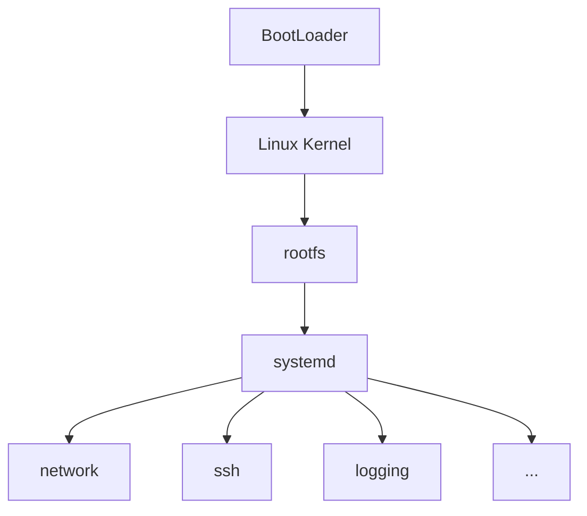

# LINUX SYSTEMD

systemd manages `units`

> UNITS

There are several types of UNITS

| Service | Description |
|---|---------|
|`.service`|Manage a service/process|
|`.target`|Group units / represent a system state|
|`.socket`|Manage sockets|
|`.timer`|Schedule things|
|`.mount`|Manage mount points|
|`.automount`|Automount filesystems|
|`.device`|Represent devices|
|`.path`|Watch filesystem paths|
|`.swap`|Manage swap|
|`.slice`|Resource management/grouping|  
<br>

> SYSTEMCTL COMMANDS

systemctl command syntax: `systemctl <action> <unit>`
1. `systemctl status colord` - status and other details
   Returns
   - Loaded: loaded (/usr/lib/systemd/system/colord.service; static)
   - Active: active (running) since Tue 2026-09-08 .....; 16min ago
   - Main PID: 1349 (colord)
   - Tasks: 4 (limit: 4598)
   - Memory: 20.9M (peak: 27.2M)
   - CPU: 553ms
   - CGroup: /system.slice/colord.service
2. `sudo systemctl start ssh` - start service
3. `sudo systemctl stop ssh` - stops service
4. `sudo systemctl restart ssh` - restart service *(stop and start)*
5. `sudo systemctl enable ssh` - configure to start during boot *(Different from start)*
6. `sudo systemctl enable --now ssh` - configure to start after future boots and start now
7. `sudo systemctl disable ssh`
8. `sudo systemctl disable --now ssh`
9. `sudo systemctl reload nginx` - reloads configuration of nginx unit
10. `sudo systemctl is-active ssh` - less verbose output of systemd unit
11. `sudo systemctl is-enabled ssh`
12. `sudo systemctl mask ssh` - mask a unit service. Mask services cant be started normally. More powerful than disable.
13. `sudo systemctl unmask ssh`
14. `sudo systemctl daemon-reload` - The unit files may have changed. Re-read them. When a unit service file is edited, 1st daemon reload then start the unit service.
15. `sudo systemctl list-units` - shows currently loaded/active units in systemd manager
16. `sudo systemctl list-unit-files` - shows installed unit files and their enablement state
17. `sudo systemctl --failed` - Shows failed units.
18. `sudo systemctl list-dependencies multi-user.target` - Lists units associated with the target
19. `sudo systemctl list-dependencies myapp.service` - Lists units associated with the unit
20. `sudo systemd-analyze critical-chain` - gives a chain of targets in the boot process
21. `sudo systemd-analyze` - returns time taken for startup
22. `sudo systemd-analyze blame` - returns significantly time taking services
23. `sudo journalctl --rotate & sudo journalctl --vacuum-time=1s` - clear journalctl entries

<br>

> SYSTEMD IN BOOT PROCESS



systemd is the PID 1. Verify this by running `ps -p 1`
returns
|PID      |TTY      |TIME           |CMD    |
|---------|---------|---------------|-------|
|1        |?        |00:00:02       |systemd|

<br>

> SERVICE

Create a file `myApplication.service` which defines how the application should be managed.
systemd user services can be created at `/etc/systemd/system/<app>.service`. All service files have an extension `.service`
service files have the following sections

```
1. [Unit]
   Description=My systemd application
   //Unit contails informaton about the unit and its relationship with other units
2. [Service]
   Type=simple
   User=myuser                    //run the application as a specific user
   WorkingDirector=/opt/myapp     // similar to cd /opt/myapp and exec myapp. Runs the app from a dir.
   Environment="APP_MODE=production"
   Environment="LOG_LEVEL=debug"  // Environment variables APP_MODE and LOG_LEVEL is available to myapp
ExecStart=/opt/myapp/myapp.sh     // Location of the service (should be executable sudo chmod +x opt/myapp/myapp.sh)
   Restart=always //valid options: no, always, on-failure, (use on-failure for production)
   RestartSec=5 //wait 5secs and restart
   After=network.target // If systemd is starting network.target and myapp, then it will start network first. It wont start network if its not scheduled to start
   Before=network.target // Similar to after
   Requires=network.target // This creates a dependancy i.e. network.target must exist for myapp to start. Different from After and Before. Can be used with After/Before
   Wants=network.target // systemd will try to start network.target when myapp is being started. If network fails, myapp can still run if it can. Requires will not let myapp start if network has failed. Requires has stronger relationship. Wants can cause a service to start, requires just checks if the service exists.
3. [Install]
   WantedBy=multi-user.target     //Grouping of services. when we enable a service, it goes as a symlink to /etc/systemd/system/multi-user.target.wants/, other groups are multi-user.target, graphical.target, network.target, rescue.target, emergency.target
```


